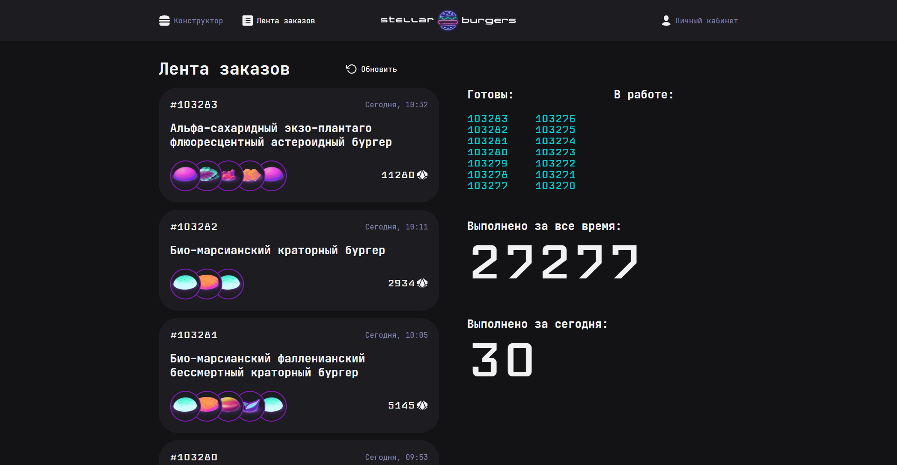

<h1 align="center">Stellar Burger</h1>

  
*Космическая бургерная - собери свой идеальный бургер!*

**Stellar Burger** - это полноценное веб-приложение для заказа бургеров, разработанное с использованием React, Redux, TypeScript и Webpack. Пользователи могут собирать бургер из ингредиентов, оформлять заказы, просматривать ленту заказов в реальном времени, а также управлять своим профилем. Проект реализует полный цикл работы с API, авторизацию, маршрутизацию и адаптивный интерфейс.

---

## 🛠 Технологии

<div align="center">
  
  
  
  
  
  
  
</div>

- **React** - построение пользовательского интерфейса.
- **Redux Toolkit** - глобальное управление состоянием (ингредиенты, конструктор, пользователь, лента заказов).
- **TypeScript** - строгая типизация и повышение надёжности кода.
- **React Router DOM** - маршрутизация и защищённые роуты.
- **Webpack** - сборка проекта, обработка статики, горячая перезагрузка.
- **Jest** - unit-тестирование redux-слайсов.
- **Storybook** - изолированная разработка и документирование UI-компонентов.
- **Cypress** - e2e-тестирование ключевых сценариев.
- **REST API** - взаимодействие с сервером (получение ингредиентов, создание заказа, авторизация и т.д.).

---

## ✨ Функциональность

- 🛠 **Конструктор бургера** - выбор булок, начинок и соусов, перетаскивание (drag-and-drop) для изменения порядка ингредиентов.
- 🧾 **Оформление заказа** - только для авторизованных пользователей, отображение номера заказа в модальном окне.
- 📋 **Лента заказов** - просмотр всех заказов в реальном времени, статистика (всего за всё время, за сегодня).
- 👤 **Личный кабинет** - редактирование профиля (имя, email, пароль), история заказов.
- 🔐 **Авторизация и регистрация** - вход/выход, восстановление пароля, защита приватных маршрутов.
- 🖼 **Модальные окна** - детальная информация об ингредиенте или заказе открывается в модалке с сохранением истории навигации.
- 🔄 **Живое обновление** - лента и история заказов обновляются при создании нового заказа (используется WebSocket).
- ✅ **Валидация форм** - проверка полей на стороне клиента с выводом сообщений об ошибках.

---

## 🔍 Особенности реализации

- **Redux Toolkit** - пять слайсов: `ingredients`, `constructor`, `user`, `feed`, `orderHistory`. Каждый слайс содержит состояние, редюсеры и асинхронные thunk-действия для работы с API.
- **Защищённые маршруты** - компонент `ProtectedRoute` проверяет авторизацию и перенаправляет неавторизованных пользователей на страницу входа.
- **Модальные окна с сохранением контекста** - используются `useLocation` и `background` из React Router для отображения модалки поверх страницы без потери истории навигации.
- **Кастомные хуки** - `useForm` для управления формами, `useDispatch` и `useSelector` с типизацией.
- **Адаптивная вёрстка** - интерфейс корректно отображается на десктопах, планшетах и мобильных устройствах.
- **Сборка Webpack** - настроена для разработки и продакшена, поддерживает импорт изображений, шрифтов, CSS-модулей, переменные окружения.
- **Тестирование** - unit-тесты слайсов (Jest), e2e-тесты ключевых сценариев (Cypress), компоненты задокументированы в Storybook.

---

## 🧱 Структура проекта

```
stellar-burger/
├── .github/               # GitHub Actions (тесты)
├── cypress/               # e2e-тесты
├── public/                # Статика (index.html, favicon)
├── src/
│   ├── components/        # Компоненты приложения (App, Header, BurgerConstructor, и т.д.)
│   │   ├── ui/            # UI-компоненты (кнопки, инпуты, модалки)
│   │   └── ...            # Логические компоненты с подключением к Redux
│   ├── pages/             # Страницы (ConstructorPage, Feed, Login, Profile, ...)
│   ├── services/          # Redux-хранилище и слайсы
│   │   ├── slices/        # Слайсы: IngredientSlice, ConstructorSlice, UserSlice, FeedSlice, OrderHistorySlice
│   │   └── store.ts       # Настройка store
│   ├── utils/             # Утилиты (cookie, API-клиент, типы)
│   ├── hooks/             # Кастомные хуки (useForm)
│   ├── images/            # Изображения (иконки, done.svg)
│   ├── styles/            # Глобальные стили
│   ├── index.tsx          # Точка входа
│   └── ...
├── .env.example
├── package.json
├── tsconfig.json
├── webpack.config.js
└── README.md
```

---

## 🚦 Запуск проекта локально

```bash
# Клонируйте репозиторий
git clone https://github.com/your-username/stellar-burger.git

# Перейдите в папку проекта
cd stellar-burger

# Установите зависимости
npm install

# Создайте файл .env на основе .env.example
cp .env.example .env
# Укажите в .env актуальный URL API (например, https://norma.education-services.ru/api)

# Запустите проект в режиме разработки
npm run dev

# Для сборки продакшн-версии
npm run build

# Запуск Storybook
npm run storybook

# Запуск тестов
npm run test
# или
npm run cypress:open
```

После выполнения `npm run dev` проект будет доступен по адресу `http://localhost:4000`.

---

## 🎯 Цель проекта

Проект выполнен в рамках учебной программы для закрепления навыков:

- работа с React и Redux Toolkit;
- реализация сложной маршрутизации с защищёнными роутами;
- интеграция с REST API и WebSocket;
- тестирование приложения (Jest, Cypress);
- документирование UI-компонентов в Storybook;
- организация кода с использованием TypeScript и модульных стилей.

---

## 📝 Что сделано мной

- Разработана полная архитектура Redux-хранилища: созданы все слайсы, асинхронные thunk-действия, селекторы.
- Настроена маршрутизация: защищённые и публичные роуты, модальные окна с сохранением истории.
- Реализован функционал конструктора бургера (добавление/удаление ингредиентов, изменение порядка, расчёт стоимости).
- Интегрированы запросы к API для получения ингредиентов, создания заказа, авторизации и управления профилем.
- Написаны unit-тесты для всех слайсов (проверка редюсеров и асинхронных действий).
- Подключены e2e-тесты для ключевых пользовательских сценариев.
- Документированы UI-компоненты в Storybook для удобства разработки и поддержки.
- Обеспечена адаптивность интерфейса и корректная работа на мобильных устройствах.
